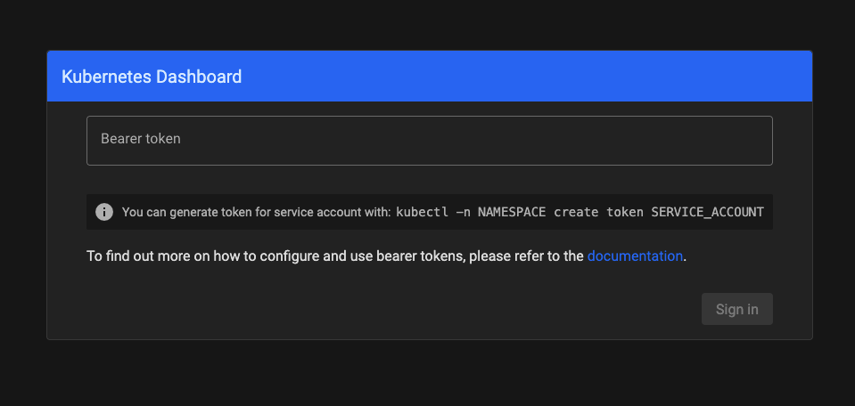
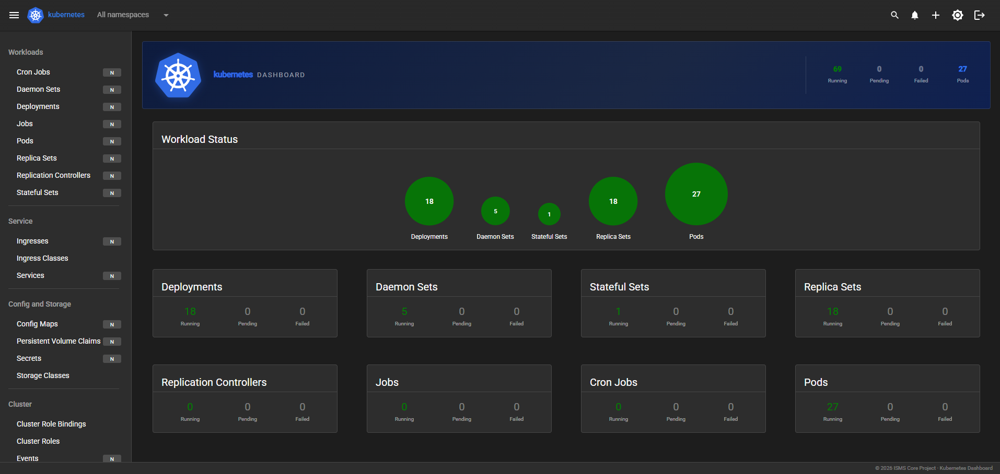
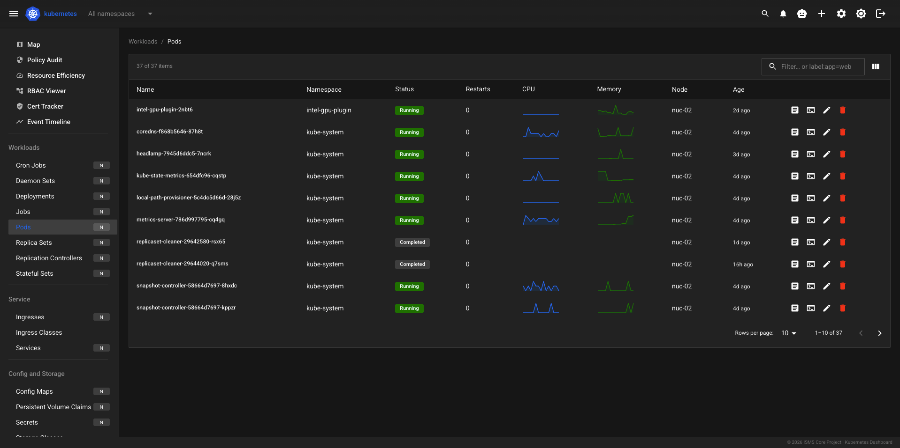
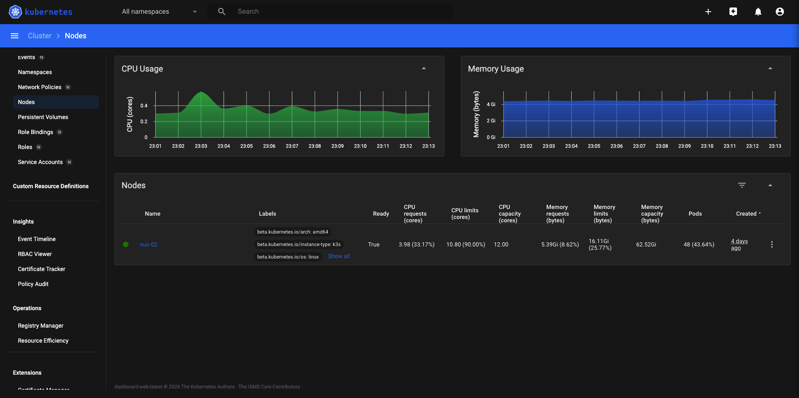
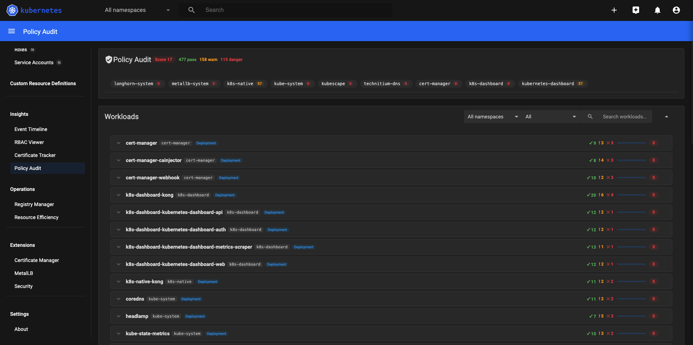
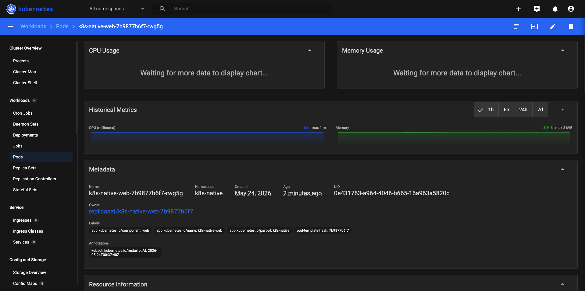
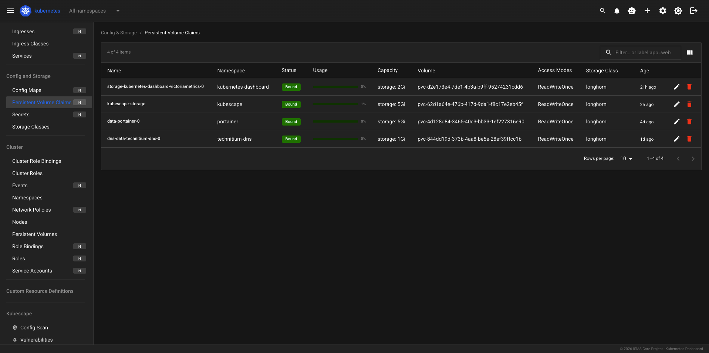

# Kubernetes Dashboard

Production deployment manifests for the Kubernetes Dashboard — a maintained continuation of the archived [kubernetes-retired/dashboard](https://github.com/kubernetes-retired/dashboard), rebuilt with React 19 and Material UI v6.

---

## Screenshots

### Sign In


### Overview
Cluster resource donuts (CPU / Memory / Pods / Nodes) plus workload status bubbles and per-kind counts at a glance.



### Cluster Map
Namespace-scoped topology view of every Deployment, DaemonSet, and StatefulSet — with Error/Warning filter and zoom controls.


### Pods
Full pod list with live CPU/Memory sparklines, restart count, node assignment, and inline log/shell/edit/delete actions.



### Nodes
Per-node CPU and memory request percentages, usage sparklines, pod capacity, and readiness status.



### Policy Audit
Polaris-native security scoring (0–100) per workload — danger and warning counts, namespace tabs, expandable check details.



### Resource Efficiency
Goldilocks-style request/limit/actual comparison for every container — No Limits, Over-Provisioned, Under-Provisioned, and OK verdicts with CSV export.


### RBAC Viewer
Cluster-wide role binding table — subject, kind, scope, binding, and rule expansion with wildcard detection.


### Certificate Tracker
TLS secrets scanned via `crypto/x509` — common name, SANs, issuer, expiry date, days remaining, and status badges.


### Event Timeline
Live cluster event feed with time-bucket grouping, Warning highlighting, namespace filter, and auto-refresh.


### Application Projects
Per-namespace project cards with pod health, workload counts, and CPU/memory request totals. System namespaces hidden by default.


### Kubescape Security
Compliance scores and CVE findings per workload — auto-detected when Kubescape Operator is running.


### VictoriaMetrics Sparklines
Pod CPU and memory sparklines with 1h/6h/24h/7d time range selector — opt-in via `VM_ENDPOINT`.



### PVC Storage Usage
Persistent Volume Claims with live usage bars sourced from the metrics server.



---

## Architecture

Five pods in the `kubernetes-dashboard` namespace, fronted by a Kong API gateway:

```
Browser
  └── Kong 3.6 (DBless, LoadBalancer)
        ├── /api/v1/login, /csrftoken, /me   → dashboard-auth
        ├── /api/*                            → dashboard-api
        │     └── sidecar: dashboard-metrics-scraper
        └── /                                 → dashboard-web (React SPA)
```

---

## Deploy

Images are published to GitHub Container Registry and pulled automatically — no build step needed.

```bash
# 1. Create the namespace first
kubectl apply -f manifests/00-namespace.yaml

# 2. Generate the CSRF key (once — save it for future deploys)
kubectl -n kubernetes-dashboard create secret generic kubernetes-dashboard-csrf \
  --from-literal=private.key="$(openssl rand 256 | base64 | tr -d '\n')"

# 3. Apply the rest
kubectl apply -f manifests/02-configmap.yaml
kubectl apply -f manifests/10-rbac.yaml
kubectl apply -f manifests/20-deployments-hardened.yaml
kubectl apply -f manifests/50-services.yaml
kubectl apply -f manifests/60-admin-user.yaml
kubectl apply -f manifests/99-network-policy.yaml
```

Verify all five pods reach Running:

```bash
kubectl get all -n kubernetes-dashboard
```

See [manifests/DEPLOY.md](manifests/DEPLOY.md) for the full runbook including optional features, AI assistant setup, and tear-down.

---

## Access

The dashboard is served via a Kong LoadBalancer service. Get the assigned IP:

```bash
kubectl get svc kubernetes-dashboard-kong -n kubernetes-dashboard
```

### Login Token

```bash
kubectl get secret admin-user -n kubernetes-dashboard \
  -o jsonpath='{.data.token}' | base64 -d
```

---

## Features

### Standard Kubernetes Resources

| Area | Details |
|---|---|
| **Workloads** | Cron Jobs, Daemon Sets, Deployments, Jobs, Pods, Replica Sets, Replication Controllers, Stateful Sets — full list + detail views |
| **Service** | Ingresses, Ingress Classes, Services |
| **Config & Storage** | Config Maps, Persistent Volume Claims, Secrets, Storage Classes |
| **Cluster** | Cluster Roles/Bindings, Events, Namespaces, Network Policies, Nodes, Persistent Volumes, Roles/Bindings, Service Accounts |
| **Custom Resource Definitions** | CRD list, detail, and per-CRD object browser |
| **Gateway API** | GatewayClasses, Gateways, HTTPRoutes — shown automatically when `gateway.networking.k8s.io` CRDs are detected |
| **Kubescape** | Config scan scores, CVE findings, eBPF NetworkPolicy generator — shown automatically when Kubescape Operator is running |
| **Pod Logs** | Live streaming, timestamps, previous container, severity filter (ALL / ERROR / WARN / INFO / DEBUG), text filter, line count, download |
| **Pod Shell** | Interactive xterm.js terminal, shell selector, connect / disconnect |

### Native Extended Features

| Feature | Route | Description |
|---|---|---|
| **Cluster Map** | `/map` | All workloads grouped by namespace as colour-coded health cards — zoom 40–150% |
| **Policy Audit** | `/audit` | 14 Polaris-style security checks per workload, scored 0–100, filterable by severity |
| **Resource Efficiency** | `/efficiency` | Goldilocks-style: CPU/memory requests vs limits vs actual, verdict chips, CSV export, trend arrows (↑↓→) when VictoriaMetrics is enabled |
| **RBAC Viewer** | `/rbac` | All bindings with resolved rules, wildcard detection, filter by subject / scope / kind |
| **Certificate Tracker** | `/certs` | TLS secrets parsed with `crypto/x509` — expiry countdown, status badges, SAN display |
| **Event Timeline** | `/timeline` | Live event feed (5 s refresh), time-bucketed, warning highlight, text filter |
| **Application Projects** | `/projects` | Per-namespace project cards with pod health, workload counts, and CPU/memory request totals |
| **Storage Usage** | PV/PVC pages | Real-time PVC usage via kubelet stats — used/available/capacity per volume, aggregate donut chart |
| **AI Assistant** | AppBar | Claude Sonnet via SSE streaming — pod spec and recent events auto-injected when on a pod page |
| **Health Digest** | Background | Daily cluster health email (score, namespace table, top issues) via Microsoft Graph API |
| **Event Alerts** | Background | Real-time email on CrashLoop / OOM / ImagePullBackOff / NodeNotReady / PVC issues; 1 h dedup |
| **ISMS CORE Integration** | `GET /api/v1/summary` | Machine-readable cluster health snapshot — node status, pod phases, policy score, cert expiry counts |
| **VictoriaMetrics** | Optional | Remote write from metrics-scraper; pod CPU/memory sparklines + trend arrows; opt-in via `VM_ENDPOINT` env var |

### Workload Actions

All workload detail pages include RBAC-aware action buttons (disabled with tooltip when the user's token lacks permission):

| Action | Deployments | DaemonSets | StatefulSets |
|---|---|---|---|
| Edit YAML / JSON | ✅ | ✅ | ✅ |
| Delete | ✅ | ✅ | ✅ |
| Restart (`kubectl rollout restart`) | ✅ | ✅ | ✅ |
| Scale | ✅ | — | ✅ |
| Rollback with revision history | ✅ | ✅ | ✅ |
| Pause / Resume | ✅ | — | — |

---

## License

Copyright 2017 The Kubernetes Authors  
Copyright 2026 The ISMS Core Project

Licensed under the Apache License, Version 2.0. See [LICENSE](LICENSE) for the full text.
