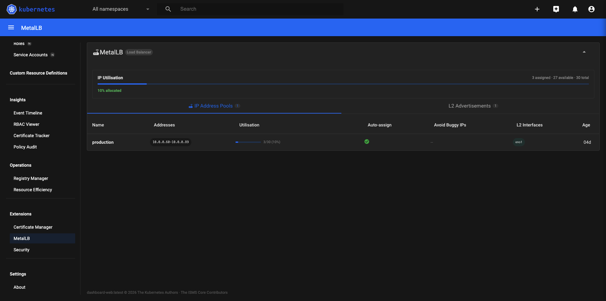
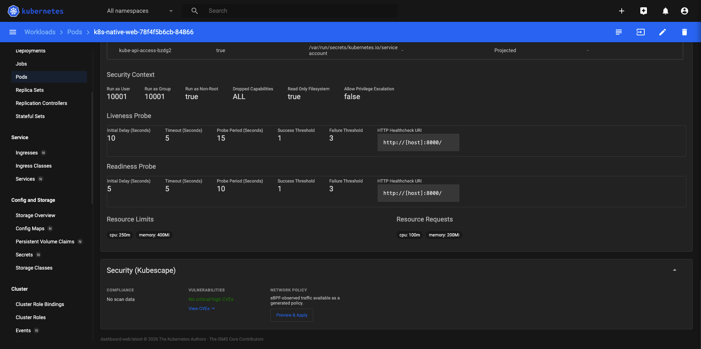

# Kubernetes Dashboard

The original [kubernetes/dashboard](https://github.com/kubernetes-retired/dashboard) was archived in January 2026 with this message:

> *"This project is now archived and no longer maintained due to lack of active maintainers and contributors. Thank you to everyone who used, starred, or contributed to this project! Feel free to fork this repository if you want to continue development yourself. Please consider using Headlamp instead."*

We took up the challenge.

The Go API backend was solid and worth keeping. The Angular WebUI was Angular 16 — already one major version behind at archive time, and drifting further every month. Rather than let it rot, we forked it and upgraded it the right way: stepping through every Angular major version one at a time — 16 → 17 → 18 → 19 → 20 → 21 — fixing all 44 catalogued breaking changes along the way. See [ANGULAR-UPGRADE.md](ANGULAR-UPGRADE.md) for the full story.

| | Angular + Angular Material |
|---|---|
| **Framework** | Angular 21, Angular Material |
| **Namespace** | `kubernetes-dashboard` |
| **Web image** | `dashboard-web-angular-latest` |
| **Manifests** | `manifests/manifests/` |
| **Deploy guide** | [DEPLOYMENT.md](DEPLOYMENT.md) |

Uses the shared Go images: `dashboard-api`, `dashboard-auth`, `dashboard-metrics-scraper`, and Kong 3.9.1. All images pull from `ghcr.io/isms-core-project/kubernetes-dashboard`.

---

## Features

- **Cluster Health Overview** — stat tiles, donut charts, live Network Traffic graph (Grafana Alloy)
- **Workloads** — full list + detail for Deployments, DaemonSets, StatefulSets, Jobs, Cron Jobs, Replica Sets
- **Workload Actions** — edit YAML, restart, scale, rollback, pause/resume, exec shell — all RBAC-aware
- **Cluster Map** — namespace-scoped topology view with health filter and zoom
- **Application Projects** — per-namespace cards with pod health and resource totals
- **Policy Audit** — Polaris-native security scoring (0–100) per workload
- **Resource Efficiency** — Goldilocks-style CPU/memory request vs limit vs actual; trend arrows via VictoriaMetrics
- **RBAC Viewer** — cluster-wide role binding table with wildcard detection
- **Certificate Tracker** — TLS secrets parsed with `crypto/x509`; expiry countdown and status badges
- **Event Timeline** — live event feed with time-bucket grouping and warning highlight
- **Registry Manager** — docker pull secrets cross-referenced with pod `imagePullSecrets`
- **Historical Metrics** — pod CPU/memory sparklines with 1h/6h/24h/7d selector (VictoriaMetrics or Prometheus)
- **Event Alerts** — real-time email on CrashLoop/OOM/ImagePullBackOff/NodeNotReady; configurable per type
- **Pod Logs** — live streaming, timestamps, severity filter, text filter, download
- **Cluster Shell** — interactive xterm.js terminal exec'd into the dashboard pod; kubectl runs as the user's JWT
- **AI Assistant** — Claude Sonnet via SSE streaming; pod spec and events auto-injected from detail pages

---

## Screenshots

### Sign In


### Overview
Stat tiles, donut charts, and Network Traffic graph.


### Workloads
Full workload list with status, restart count, and inline actions.


### Cluster Map
Namespace-scoped topology with health filter and zoom.


### Pods
Live CPU/Memory sparklines, restart count, node assignment.


### Nodes
Per-node CPU and memory request percentages and pod capacity.


### Policy Audit
Polaris security scoring per workload.


### Resource Efficiency
Goldilocks-style CPU/memory comparison with trend arrows.


### Certificate Manager
cert-manager Certificates, Issuers, and ClusterIssuers — auto-detected.


### Certificate Tracker
TLS secrets scanned with `crypto/x509` — expiry countdown and status badges.


### MetalLB
IP Address Pools and L2 Advertisements — auto-detected when MetalLB CRDs are present.



### Pod Security / Network Policies
Pod Security Standards and NetworkPolicy visualisation.



### Event Timeline
Live event feed with time-bucket grouping.


### Application Projects
Per-namespace project cards.


### Kubescape Security
Compliance scores and CVE findings — auto-detected.


### VictoriaMetrics Sparklines
Pod CPU/memory sparklines with 1h/6h/24h/7d selector.


### PVC Storage Usage
Live usage bars from the kubelet stats API.


### RBAC Viewer
All role bindings with resolved rules and wildcard detection.


### Cluster Shell
Full interactive bash terminal.


---

## Architecture

Five pods in the dashboard namespace, fronted by a Kong API gateway:

```
Browser
  └── Kong 3.9.1 (DBless, NodePort :30080)
        ├── /api/v1/login, /csrftoken, /me   → dashboard-auth
        ├── /api/*                            → dashboard-api
        │     └── sidecar: dashboard-metrics-scraper
        └── /                                 → dashboard-web (SPA)
```

Optional add-ons (all in the same namespace):

| Add-on | Manifest | Enables |
|---|---|---|
| Grafana Alloy | `25-alloy.yaml` | Network Traffic graph on Overview |
| VictoriaMetrics | `26-victoriametrics.yaml` | Pod CPU/memory sparklines, trend arrows, network graph |
| Prometheus | External (`kube-prometheus-stack`) | Same sparklines — set `PROMETHEUS_ENDPOINT` instead of `VM_ENDPOINT` |

---

## Deploy

See [DEPLOYMENT.md](DEPLOYMENT.md) for the full runbook.

---

## License

Copyright 2017 The Kubernetes Authors  
Copyright 2026 The ISMS Core Project

Licensed under the Apache License, Version 2.0. See [LICENSE](LICENSE) for the full text.
